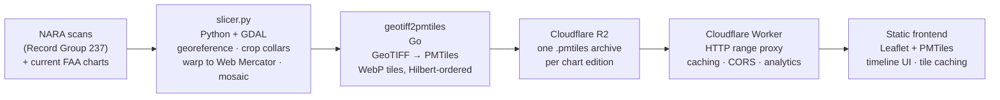

# archive.aero ✈️

**Nearly a century of U.S. aeronautical charts, scrubbable like a time machine.**

[archive.aero](https://archive.aero) is a free, open-source web viewer for historical FAA VFR Sectional charts — **3,391 chart editions spanning 1930 to today**, georeferenced, mosaicked, tiled, and served from edge storage. Drag the timeline and watch airspace, airports, and cartography evolve across nine decades.

> ⚠️ Every chart on the site is a historical scan. **Never use it for navigation.**

**Live site:** [archive.aero](https://archive.aero) · **How it works:** [archive.aero/about.html](https://archive.aero/about.html)

---

## What it does

- **Timeline scrubbing** through every U.S. Sectional edition since 1930, with play/pause animation and keyboard shortcuts
- **Seamless nationwide mosaics** — individual chart sheets are stitched into a single layer per edition, so you pan the whole country at any date
- **Fast on any device** — static site, no application backend; tiles stream straight from object storage as WebP
- **Shareable views** — URLs encode date, position, and zoom
- **Mobile-aware** — touch controls, geolocation, and iOS Safari memory management tuned for tablets in the cockpit (for history browsing, not navigation!)

## Architecture

The system is three independent pieces: a **data pipeline** that turns archival scans into tile archives, **edge storage/delivery**, and a **static frontend**.

### 1. Chart processing pipeline — [`slicer.py`](scripts/slicer.py) (Python + GDAL)

Takes raw chart scans (from the U.S. National Archives for historical editions, FAA digital products for current ones), georeferences them, crops the paper collars, warps everything to Web Mercator, and mosaics the individual sheets into one nationwide GeoTIFF per edition date. Handles scans that are actually PDFs, mixed projections, and decades of inconsistent FAA cartographic conventions.

### 2. Tile conversion — [`geotiff2pmtiles/`](geotiff2pmtiles/) (Go)

A standalone, memory-efficient converter from GeoTIFF to [PMTiles](https://github.com/protomaps/PMTiles) single-file tile archives, with native WebP encoding, multiple resampling methods, and Hilbert-curve tile ordering. Has its own [README](geotiff2pmtiles/README.md), [ARCHITECTURE](geotiff2pmtiles/ARCHITECTURE.md), and [DESIGN](geotiff2pmtiles/DESIGN.md) docs.

### 3. Delivery — [`worker/`](worker/) (Cloudflare Worker + R2)

Each edition is one immutable `.pmtiles` file in R2. A small Worker proxies HTTP range requests to R2, adds caching and CORS, and logs sampled usage to Analytics Engine — no tile server, no database, no application backend. See [worker/README.md](worker/README.md).

### 4. Frontend — [`index.html`](index.html) (vanilla JS + Leaflet)

A single-page app with no framework and no build step. The interesting parts:

- **Double-buffered chart layers** — the outgoing edition stays visible until the incoming one is ready, so scrubbing the timeline never flashes the basemap
- **LRU tile caches** (decoded bitmaps + raw data) with backpressure, plus reduced limits and `ImageBitmap` fallbacks for iOS Safari's memory constraints
- **Prefetching** of adjacent editions while you scrub, with reference-counted in-flight loads
- **Accessible UI** — keyboard shortcuts (`←` `→` `Space` `F` `S` `?`), ARIA labels, focus management

## Data sources

Historical charts are digitized scans held by the [U.S. National Archives](https://catalog.archives.gov/) (Record Group 237 — Records of the Federal Aviation Administration); current editions come from FAA digital products. Full attribution and licensing: [archive.aero/sources.html](https://archive.aero/sources.html).

## Roadmap

- **Terminal Area Charts (TACs)** alongside Sectionals
- **Worldwide** historical coverage
- Keep the site **free** — if hosting costs ever demand it, aviation-related sponsorships before paywalls

## About

Built and maintained by [Ryan Hemenway](https://ryanhemenway.com), a private pilot who wanted a "ForeFlight Time Machine" and decided to build one. If the project is useful to you, you can [support it here](https://buymeacoffee.com/ryanhemenway).
