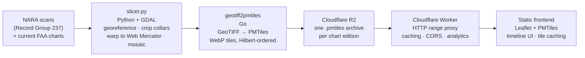

# archive.aero ✈️

**Nearly a century of U.S. aeronautical charts, scrubbable like a time machine.**

[archive.aero](https://archive.aero) is a free, open-source web viewer for historical FAA VFR Sectional charts — **7,668 chart editions across 3,741 edition dates (as of September 2026), spanning 1930 to today**, georeferenced, mosaicked, tiled, and served from edge storage. Drag the timeline and watch airspace, airports, and cartography evolve across nine decades.

> ⚠️ Every chart on the site is a historical scan. **Never use it for navigation.**

**Live site:** [archive.aero](https://archive.aero) · **How it works:** [archive.aero/about](https://archive.aero/about)

---

## What it does

- **Timeline scrubbing** through every U.S. Sectional edition since 1930, with play/pause animation and keyboard shortcuts
- **Seamless nationwide mosaics** — individual chart sheets are stitched into a single layer per edition, so you pan the whole country at any date
- **Fast on any device** — static site, no application backend; tiles stream straight from object storage as WebP
- **Shareable views** — URLs encode date, position, and zoom
- **Mobile-aware** — touch controls, geolocation, and iOS Safari memory management tuned for tablets in the cockpit (for history browsing, not navigation!)

## Architecture

The system is three independent pieces: a **data pipeline** that turns archival scans into tile archives, **edge storage/delivery**, and a **static frontend**.


```mermaid
flowchart LR
    A["NARA scans<br/>(Record Group 237)<br/>+ current FAA charts"] --> B["slicer.py<br/>Python + GDAL<br/>georeference · crop collars<br/>warp to Web Mercator · mosaic"]
    B --> C["geotiff2pmtiles<br/>Go<br/>GeoTIFF → PMTiles<br/>WebP tiles, Hilbert-ordered"]
    C --> D["Cloudflare R2<br/>one .pmtiles archive<br/>per chart edition"]
    D --> E["Cloudflare Worker<br/>HTTP range proxy<br/>caching · CORS · analytics"]
    E --> F["Static frontend<br/>Leaflet + PMTiles<br/>timeline UI · tile caching"]
```

### 1. Chart processing pipeline — [`slicer.py`](scripts/slicer.py) (Python + GDAL)

Takes raw chart scans (from the U.S. National Archives for historical editions, FAA digital products for current ones), georeferences them, crops the paper collars, warps everything to Web Mercator, and mosaics the individual sheets into one nationwide GeoTIFF per edition date. Handles scans that are actually PDFs, mixed projections, and decades of inconsistent FAA cartographic conventions.

### 2. Tile conversion — geotiff2pmtiles (Go, separate repository)

A standalone, memory-efficient converter from GeoTIFF to [PMTiles](https://github.com/protomaps/PMTiles) single-file tile archives, with native WebP encoding, multiple resampling methods, and Hilbert-curve tile ordering. It is an external CLI dependency from [pspoerri/geotiff2pmtiles](https://github.com/pspoerri/geotiff2pmtiles). The PMTiles run-length fix was merged upstream in [PR #49](https://github.com/pspoerri/geotiff2pmtiles/pull/49).

`slicer.py --chart-pmtiles ...` checks upstream `main` once at startup and
installs that commit with `CGO_ENABLED=1`, preserving lossy WebP quality 80.
Binaries and build provenance are cached by commit outside the project:
`~/Library/Caches/archive.aero/geotiff2pmtiles/` on macOS, or
`${XDG_CACHE_HOME:-~/.cache}/archive.aero/geotiff2pmtiles/` on Linux.
An existing build is reused; a missing or newer revision is downloaded and built.
The selected binary stays fixed throughout the batch. A failed
update stops the run rather than silently using stale code. Ordinary GeoTIFF-only
slicer runs do not fetch or build g2p.

Prerequisites: Git, Python 3, Go with automatic toolchain downloads enabled
(`GOTOOLCHAIN=auto`, Go's default), a C compiler, pkg-config, and libwebp.
On macOS: `brew install go pkg-config webp` plus the Xcode command-line tools.
Upstream's `go.mod` controls the required Go version.

For standalone mosaic conversion, resolve the current dependency once per batch:

```sh
g2p="$(python3 scripts/install_geotiff2pmtiles.py)" || exit 1
"$g2p" -format webp -quality 80 input.tif output.pmtiles
```

The installer also updates `bin/geotiff2pmtiles` inside that user cache for direct CLI use.
To rerun a specific build or work offline, pass
`--geotiff2pmtiles-bin /absolute/path/to/geotiff2pmtiles` to the slicer; this
explicit override skips the update. A development checkout is not required;
keep any checkout used for upstream contributions outside this project.

### 3. Delivery — [`worker/`](worker/) (Cloudflare Worker + R2)

Each edition is one immutable `.pmtiles` file in R2. A small Worker proxies HTTP range requests to R2, adds caching and CORS, and logs sampled usage to Analytics Engine — no tile server, no database, no application backend. See [worker/README.md](worker/README.md).

### 4. Frontend — [`index.html`](index.html) + [`src/viewer.js`](src/viewer.js) (vanilla JS + Leaflet)

A single-page app with no framework or bundler. Native ES modules are fingerprinted
by a small Node script; the generated assets are committed, so static hosting needs
no build command. The interesting parts:

- **Double-buffered chart layers** — the outgoing edition stays visible until the incoming one is ready, so scrubbing the timeline never flashes the basemap
- **LRU tile caches** (decoded bitmaps + raw data) with backpressure, plus reduced limits and `ImageBitmap` fallbacks for iOS Safari's memory constraints
- **Prefetching** of adjacent editions while you scrub, with reference-counted in-flight loads
- **Accessible UI** — keyboard shortcuts (`←` `→` `Space` `F` `S` `?`), ARIA labels, focus management

#### Frontend changes and dependencies

Edit `src/`, then run `npm run build:frontend` and commit the generated `assets/`
files with `index.html`. `npm run check:frontend` detects stale artifacts and checks
vendored bytes against the locked npm packages and the existing SRI hashes.
The metadata/airspace builders still accept `--update-html index.html`; they now
update `src/viewer.js` and regenerate the module graph automatically (requires Node).

Leaflet 1.9.4 (including CSS/images), PMTiles 3.0.6, Protomaps Leaflet 5.0.0, and
PapaParse 5.4.1 are served from versioned `vendor/` paths. Reproduce them with
`npm ci && npm run vendor:frontend`. PapaParse loads only when the metadata bundle
cannot be used and the viewer needs `dates.csv`. Normal startup requests no unpkg
resources. Fonts, analytics, geolocation and chart-data origins are unchanged.

Content-hashed module URLs and versioned vendor URLs are safe to cache. Keep prior
deployed hashes available for cached HTML; the build does not delete them. Actual
cache headers remain controlled by the existing GitHub Pages/Cloudflare hosting,
not a repository `_headers` file. Do not edit vendored files or hashed outputs in
place; see [`vendor/README.md`](vendor/README.md) for dependency update details.

### 5. ATC History collection — [`worker-atc/`](worker-atc/) (Cloudflare Worker + R2)

archive.aero is also the permanent home of the
[Air Traffic Control History collection](https://archive.aero/atc/) —
the atchistory.org archive of FAA Flight Service Station history (facility
photos, training class photos, airway maps, scanned publications), flattened
to a fully static site. A dedicated Worker serves it from the `atc-site` R2
bucket under `/atc/` and 301s every old atchistory.org URL to its preserved
page. The content itself (≈3.6 GB) lives only in R2 and the offline build
tree — never in this repo.

The facility-location browser is restored by `worker-atc/src/facilities.js`:
native state dropdowns link to server-rendered city galleries. Its public
metadata index (303 locations, 993 entries) is generated from the preserved
site with `python3 scripts/atc_build_facilities.py`. After refreshing that
index or changing the rendered markup, increment `FACILITIES_VERSION` to
invalidate HTML cache entries and validators, then deploy `worker-atc`.
Original articles and photographs remain in R2.

## Data sources

Historical charts are digitized scans held by the [U.S. National Archives](https://catalog.archives.gov/) (Record Group 237 — Records of the Federal Aviation Administration); current editions come from FAA digital products. Full attribution and licensing: [archive.aero/sources](https://archive.aero/sources).

## Roadmap

- **Terminal Area Charts (TACs)** alongside Sectionals
- **Worldwide** historical coverage
- Keep the site **free** — if hosting costs ever demand it, aviation-related sponsorships before paywalls

## About

Built and maintained by [Ryan Hemenway](https://ryanhemenway.com), a private pilot who wanted a "ForeFlight Time Machine" and decided to build one. If the project is useful to you, you can [support it here](https://buymeacoffee.com/ryanhemenway).
